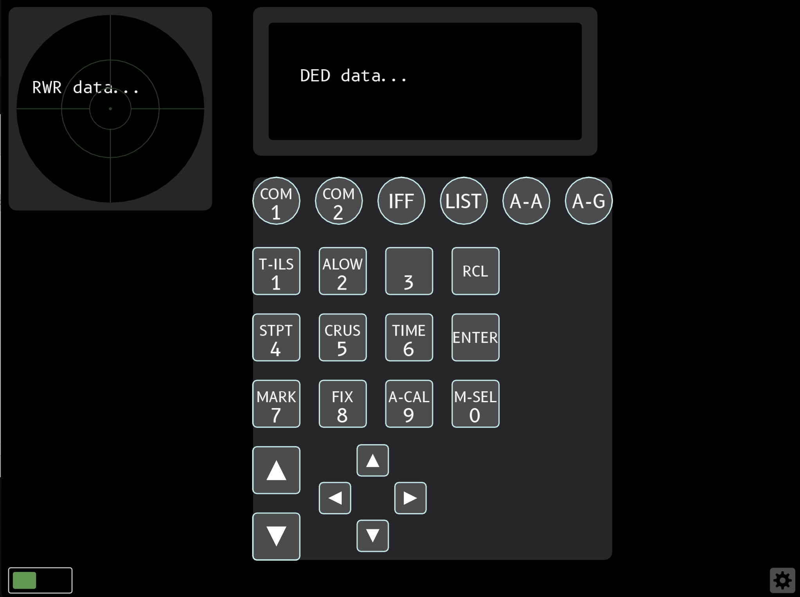
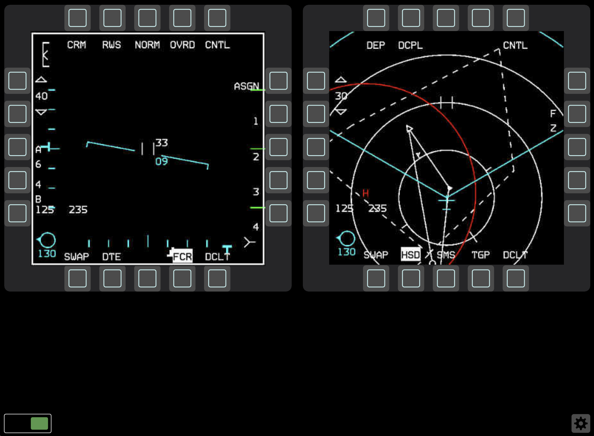
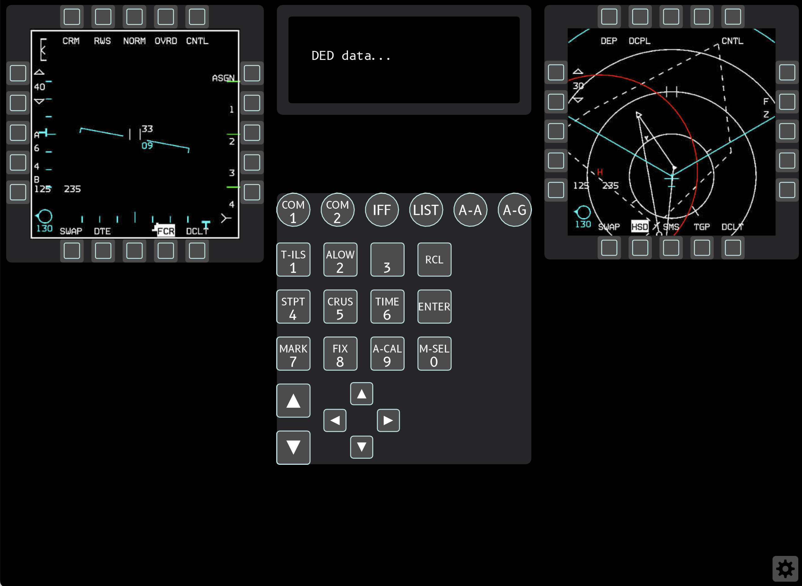
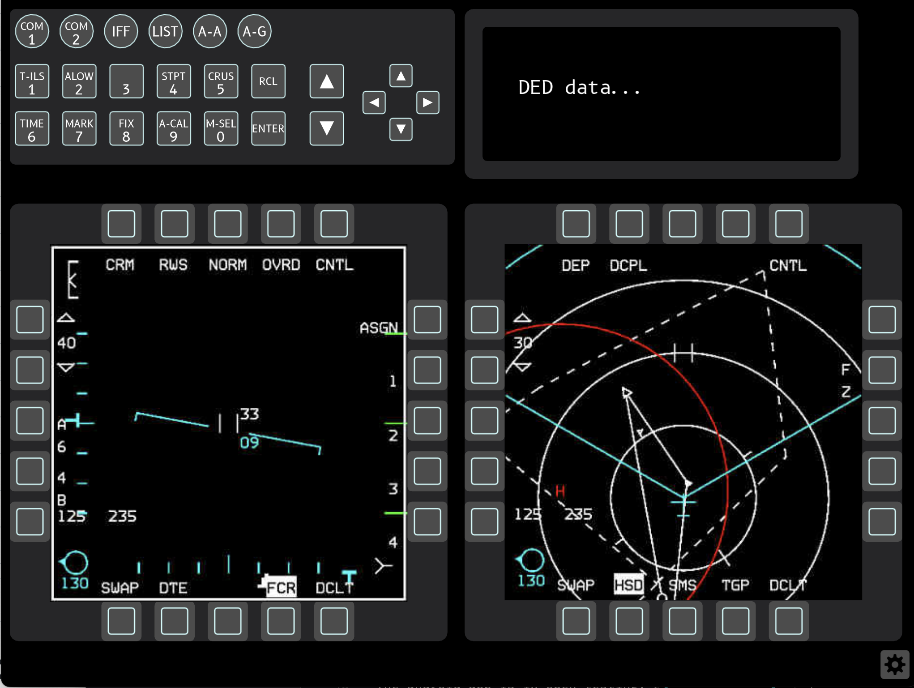

# Falcon BMS Control

Falcon BMS Control lets you control Falcon BMS from any touch enabled device.

Releases for both iOS and android are available for free. The client and server code will be open-source once it is polished and documented.

## TL;DR: How to use it?

- Install the app on your device (Tablet, Phone, Chromebook, Laptop with touchscreen)
- Install the latest windows server application on your BMS host PC: [Releases](https://github.com/kungfoo/falcon-bms-control/releases/)
- Enable RTT exports in `${falcon bms install}/user/config/Falcon BMS User.cfg`: set `g_bExportRTTTextures 1` (using the user.cfg file will pevent the updater from overwriting your settings during an update)
- Allow the server application in Windows Firewall

## Screenshots (client)

### Default layout

The default layout either shows the ICP, DED and RWR or both MFDs on the screen. There is a switcher in the lower left corner to switch between screens.

### Cockpit-like layout

A new layout that emulates the layout of the F16 cockpit, no screen switching since all devices are present. This will only properly work on rather big touchscreens/tablets.

### Consolidated layout

A consolidated layout with all devices on one screen, but with a landscape ICP to save screen real estate. This can be quite useful on medium screens.

### One device per screen

There is also a layout with one device (LMFD, RMFD or ICP) per screen. This is useful when you want to have multiple tablets/phones show one device each.

## How does it look?

Here's a (rather old by now) video by Fish that explains most things much better than I can:

<iframe width="560" height="315" src="https://www.youtube.com/embed/Z7E0uswkFmo" title="YouTube video player" frameborder="0" allow="accelerometer; autoplay; clipboard-write; encrypted-media; gyroscope; picture-in-picture" allowfullscreen></iframe>

## Can I disable automatic server discovery?

Yes. Go to the in-app settings screen and enter the ip address of your server into the appropriate field. Once you leave the screen and (if already connected) restart the app, it will directly connect to the specified server address.

## Can I re-enable automatic server discovery?

Yes. Go to the in-app settings screen and clear the server ip address field. Once it's empty, the app will switch back to automatic discovery.

## Known Limitations

- Currently the server app does not support binds to DX buttons in the keyfile, such as hardware MFD frames, so you will have to _at least_ have binds to keyboard key presses. Additional DX key binds are okay to have.
- Works best with `BMS Full.key`, since that one has all the key binds for all the functions.

## iOS app

Find the iOS release of the app here:

[Falcon BMS Control for iOS](https://apps.apple.com/tt/app/falcon-bms-control/id1542670299)

## Android app

The android app is in open testing, available on the play store:

[Falcon BMS Control for Android](https://play.google.com/store/apps/details?id=ch.mollusca.falconbmscontrol)

## Windows client application

A windows client is available here:

[Falcon BMS Control for Windows](https://github.com/kungfoo/falcon-bms-control/releases/)

Please make sure to run the client on _another computer_ than the one that runs BMS, as due to way the client/server/BMS interact, it _will not work properly running on the same machine_.

## Linux client application

A linux client is available as an appimage from the releases page as of `1.3.1`:

[Falcon BMS Control for Linux](https://github.com/kungfoo/falcon-bms-control/releases/)

## Windows server application

The client applications for both iOS and android will try to discover and connect to the `falcon-bms-control` server running on the same network automatically.

Download the server application from here:

[Falcon BMS Control Server](https://github.com/kungfoo/falcon-bms-control/releases/) and run the application alongside Falcon BMS.

If automatic discovery does not work for you on your network, please file an issue at: [Issues](https://github.com/kungfoo/falcon-bms-control/issues)

### Windows Firewall

Windows Firewal will ask you to allow the server application to communicate on the network when you first run it. Not allowing it to do that will render the clients unable to discover the server and unusable.

## Client settings

All client settings are effective immediately and persised across runs of the application.

- Displays refresh rate: lower for slow devices and networks
  - 15fps
  - 30fps: default
  - 60fps

- Displays compression quality: lower for slow networks
  - Range from 50 to 90

- Server IP: For network setups where automatic discovery is not desired or does not work.

- Vibration: Provide haptic feedback on button pushes on devices that have the hardware for it.

## FAQ

### I get a windows language switch popup on some keypresses?

On some systems with multiple input languages, the shortcut for language input switching conflicts with the default BMS key binds. The easiest solution is probably to unbind the shortcut in Windows language preferences.

### I have a very slow android device, can I run it?

You will probably want to set the display refresh rate to 15fps on a very slow devices, but the rest of the app should work fine. The changes are effective immediately.

### I am on a very slow wifi, can I save bandwidth?

You can turn down the compression quality of the exported displays to save _significant_ amounts of bandwidth. The default is 80, try setting it to ~60 for a first try. The changes are effective immediately.

## Client Goals

- be cross platform
- require zero configuration (maybe allow for some)
- auto discovery of server from multiple clients
- responsive controls
- work well on touch devices
- make most of the screen space available

## Client Non-Goals

- photorealistic graphics
- replace more advanced and configurable tools like [Helios](https://github.com/HeliosVirtualCockpit/Helios)

## Privacy Policy

This app collects _none_ of your data. No data whatsoever is collected.
